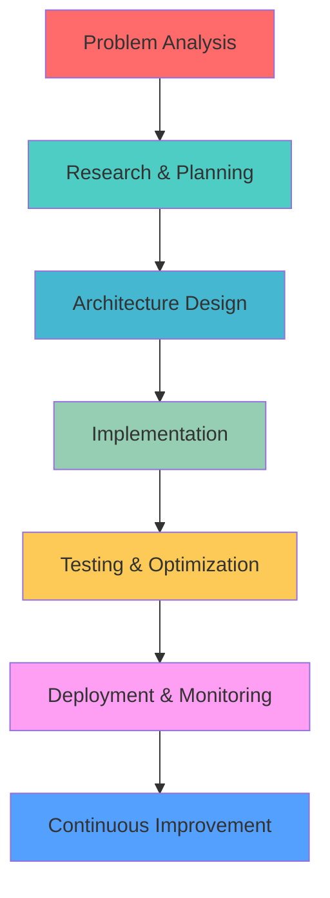

#  Hey, I'm Akarsh Mishra

<div align="center">

[](https://git.io/typing-svg)


</div>

## 🧑‍💻 About Me


```typescript
interface Developer {
  name: string;
  role: string;
  location: string;
  education: string;
  languages: string[];
  specialties: string[];
  currentFocus: string[];
  lifePhilosophy: string;
}

const akarsh: Developer = {
  name: "Akarsh Mishra",
  role: "Full-Stack Developer & Computer Science Student",
  location: "India 🇮🇳",
  education: "Bachelor of Computer Applications",
  languages: ["Java", "JavaScript", "TypeScript", "Python", "SQL"],
  specialties: [
    "🌐 Full-Stack Web Development",
    "☁️ Cloud Architecture & Deployment", 
    "🔄 RESTful APIs & Microservices",
    "📱 Responsive UI/UX Design",
    "🗄️ Database Design & Optimization"
  ],
  currentFocus: [
    "Advanced React Patterns & Performance",
    "Machine Learning Integration",
    "DevOps & Cloud Technologies",
    "Open Source Contributions"
  ],
  lifePhilosophy: "Code with purpose, learn continuously, impact positively! 🚀"
};
```

<br clear="right"/>

---

## 🎯 Current Mission & Vision

<details>
<summary><b>🚀 What I'm Building Right Now</b> <i>(click to expand)</i></summary>
<br>
### 🚀 Featured Projects

| 🏗️ Project         | 📝 Description                                      | 🛠️ Tech Stack                                        | 📊 Status        | 🔗 Links                                                                 |
|---------------------|------------------------------------------------------|------------------------------------------------------|------------------|-------------------------------------------------------------------------|
| **☁️ CloudVault**   | Next-gen cloud storage with AI-powered features     | `React` • `Node.js` • `MongoDB` • `AWS S3`           | 🧩 Planning       | 🔗 [Demo](#) • 💻 [Code](#)                                              |
| **💬 Naradly 2.0**  | Anonymous chat platform with real-time communication| `React` • `Socket.io` • `Redis` • `Fire-Base`           | 🧪 Beta Testing   | 🔴 [Live](#) • 💻 [Repo](https://github.com/akarshmi/Naradly-public)    |
| **🎨 DevPortfolio** | Interactive portfolio with 3D effects and animation | `React` • `Email.js` • `Framer Motion`             | ✅ Completed      | 🟢 [Live](https://akarshmi.netlify.app) • 💻 [Code](#)                   |
| **🤖 SpecScoreX**   | ML-powered system performance analysis tool         | `Python` • `Flask` • `FastAPI`                  | 🔬 In Development | 🟢 [Live](https://specscorex.onrender.com) • 💻 [Repo](#)                |

</details>

<details>
<summary><b>🎯 2025-26 Roadmap & Learning Goals</b> <i>(click to expand)</i></summary>
<br>

### Q1 2025-26 🌱
- [ ] **Advanced React Ecosystem**: Redux Toolkit Query, React Suspense, Concurrent Features
- [ ] **Node.js Performance**: Clustering, Worker Threads, Memory Optimization
- [ ] **System Design**: Load Balancing, Caching Strategies, Database Sharding

### Q2 2026 🚀  
- [ ] **Machine Learning**: TensorFlow.js, Computer Vision, NLP Integration
- [ ] **Cloud Architecture**: AWS Solutions Architecture, Kubernetes, Serverless
- [ ] **Mobile Development**: React Native, Flutter, Cross-platform strategies

### Q3 2026 🎯
- [ ] **DevOps Mastery**: CI/CD Pipelines, Infrastructure as Code, Monitoring
- [ ] **Open Source**: Maintain 2+ active projects, 50+ meaningful contributions
- [ ] **Leadership**: Mentor juniors, tech talks, community building

### Q4 2026 🏆
- [ ] **Advanced Topics**: WebAssembly, Blockchain integration, Edge computing
- [ ] **Certification**: AWS Solutions Architect, Google Cloud Professional
- [ ] **Publication**: Technical blog with 10k+ monthly readers

</details>

---

## 🛠️ Technology Arsenal

<div align="center">

### 💻 Programming Languages


### 🚀 Frontend Technologies


### ⚡ Backend & APIs


### 🗄️ Databases & Storage


### ☁️ Cloud & DevOps


### 🛠️ Development Tools


</div>

---

## 📊 GitHub Analytics & Performance

<div align="center">


</div>

### 📈 Contribution Activity
<div align="center">

[](https://github.com/ashutosh00710/github-readme-activity-graph)

</div>

---

## 🏆 Featured Projects & Achievements

<div align="center">

### 🌟 Flagship Projects

<a href="https://github.com/akarshmi/ATM_Interface">
  
</a>
<a href="https://github.com/akarshmi/Naradly-public">
  
</a>

<a href="https://github.com/akarshmi/College-Management-System">
  
</a>
<a href="https://github.com/akarshmi/Number_Guess_Game">
  
</a>

</div>

### 🎖️ Certifications & Achievements

<div align="center">


**📈 Performance Metrics**
- **500+** Problems Solved on HackerRank
- **15+** Projects Completed
- **3** Years of Consistent Coding
- **Open Source** Contributor

</div>

---

## 💼 Professional Experience & Skills

<div align="center">

### 🎯 Core Competencies

<table>
<tr>
<td align="center" width="33%">

<br><b>Full-Stack Development</b>
<br><i>End-to-end application development</i>
</td>
<td align="center" width="33%">

<br><b>Cloud & DevOps</b>
<br><i>Scalable infrastructure & deployment</i>
</td>
<td align="center" width="33%">

<br><b>Database Management</b>
<br><i>Design, optimization & scaling</i>
</td>
</tr>
</table>

</div>

### 🧠 Problem-Solving Approach


---

## 🤝 Let's Collaborate & Connect

<div align="center">

### 🌐 Find Me Around the Web

[](https://www.linkedin.com/in/akarshmi/)
[](#)
[](https://www.hackerrank.com/akarshmi)
[](https://www.instagram.com/akarshmi/)

### 📧 Let's Build Something Amazing Together

[](mailto:akarshmi.am@gmail.com)
[](#)

</div>

### 🤝 Open to Collaboration On:

- **🚀 Innovative Web Applications** - Full-stack projects with modern tech
- **☁️ Cloud-Native Solutions** - Scalable, distributed systems
- **🤖 AI/ML Integration** - Bringing intelligence to web applications  
- **🌍 Open Source Projects** - Contributing to the developer community
- **📱 Cross-Platform Development** - Mobile and web unified experiences

---

## 🎯 What Drives Me

<div align="center">

### 💭 My Development Philosophy

> *"Great software is not just about solving problems—it's about creating experiences that make people's lives better, more efficient, and more enjoyable."*

<table align="center">
<tr>
<td align="center">
<br>
<b>Clean Code</b><br>
<i>Readable, maintainable, scalable</i>
</td>
<td align="center">
<br>
<b>User-Centric Design</b><br>
<i>Intuitive, accessible, beautiful</i>
</td>
<td align="center">
<br>
<b>Performance First</b><br>
<i>Fast, efficient, optimized</i>
</td>
<td align="center">
<br>
<b>Continuous Learning</b><br>
<i>Evolving, adapting, growing</i>
</td>
</tr>
</table>

</div>

---

## 📈 Community & Impact

<div align="center">

### 🌟 Community Engagement


### 🎯 Impact Metrics 2024-2025

- **💻 Lines of Code**: 50,000+ (and counting)
- **🚀 Projects Completed**: 15+ Full-Stack Applications
- **🤝 Collaborations**: 5+ Team Projects
- **📚 Knowledge Shared**: Tech blogs, code reviews, mentoring
- **🌟 Open Source**: Contributing to developer tools and libraries

</div>

---

## 💡 Latest Blog Posts & Content

<div align="center">

<!-- BLOG-POST-LIST:START -->
**📝 Recent Articles**
- [Building Scalable React Applications with Performance in Mind](#)
- [The Ultimate Guide to Node.js Performance Optimization](#)
- [Cloud-First Development: AWS Best Practices for Full-Stack Developers](#)
- [Modern State Management in React: Beyond Redux](#)
<!-- BLOG-POST-LIST:END -->

[](#)
[](#)

</div>

---

<div align="center">

### 🎨 Fun Zone

<details>
<summary><b>🎮 When I'm Not Coding...</b> <i>(click for some fun!)</i></summary>
<br>

```ascii
    🎯 Hobbies & Interests
    ┌─────────────────────────────┐
    │  🎮 Gaming & Game Dev       │
    │  📚 Tech Books & Podcasts   │
    │  🏃‍♂️ Running & Fitness       │
    │  🎵 Music Production        │
    │  📷 Photography             │
    │  🍳 Cooking Experiments     │
    └─────────────────────────────┘
```

**🎯 Fun Facts:**
- I can solve a Rubik's cube in under 2 minutes! 🧩
- Coffee consumption directly correlates with code quality ☕
- I've written more lines of code than I've walked steps (probably) 👣
- My rubber duck debugging sessions are legendary 🦆

</details>

### 🎵 *"The best error message is the one that never shows up."* - Thomas Fuchs

**Thank you for exploring my digital space! Let's create something incredible together! 🚀✨**


---

<p align="center">

</p>

**Made with ❤️, ☕, and lots of 🧠 by Akarsh Mishra**


</div>
